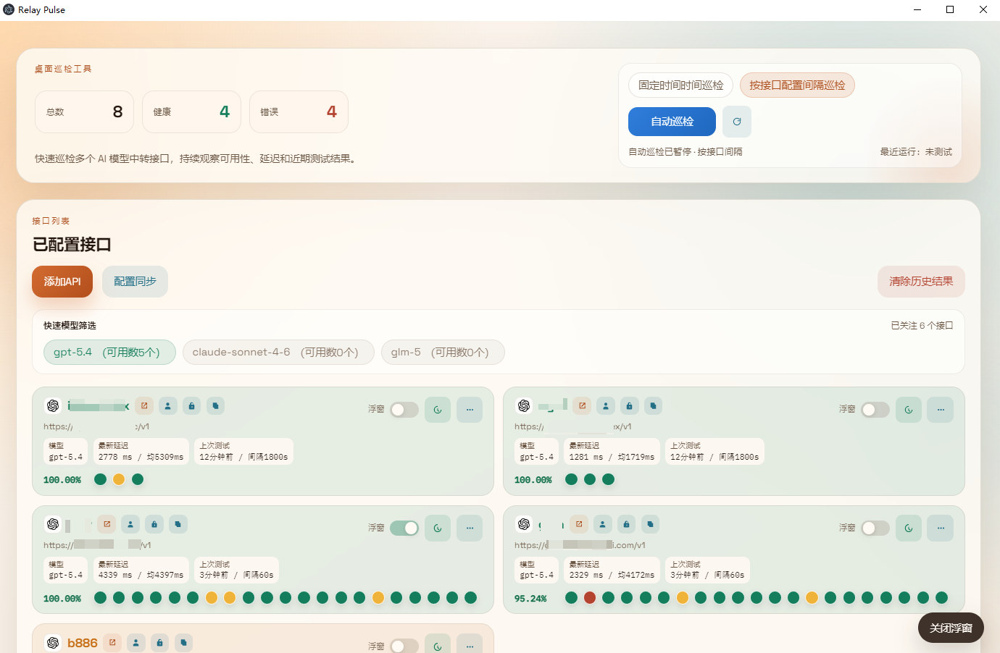
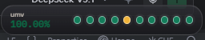

# Relay Pulse

Relay Pulse is a desktop monitoring tool for OpenAI-compatible relay endpoints.  
Relay Pulse 是一个用于监控 OpenAI 兼容中转接口的桌面工具。

It lets you save multiple relay configurations, run one-off or scheduled health checks, watch recent latency and availability, back up configuration to a private GitHub Gist, and apply a saved relay directly to local `Codex CLI` or `OpenCode` configuration files.  
它支持保存多个中转配置，执行手动或定时健康检查，查看最近延迟与可用性，将配置备份到私有 GitHub Gist，并把已保存的中转配置直接应用到本地 `Codex CLI` 或 `OpenCode` 配置文件。

## Features | 功能特性

- Manage multiple relay endpoints in a desktop UI built with Electron + React  
  使用 Electron + React 桌面界面管理多个中转接口
- Run scheduled checks or manual checks against each configured API  
  对每个已配置 API 执行定时巡检或手动巡检
- Track per-endpoint availability, latest latency, average latency, and recent check history  
  跟踪每个接口的可用性、最近延迟、平均延迟和近期测试历史
- Keep a rolling in-app event log for operational visibility  
  保留应用内滚动事件日志，便于观察运行状态
- Save configuration locally and automatically encrypt API keys, passwords, and Gist tokens before writing to disk  
  本地保存配置，并在落盘前自动加密 API Key、密码和 Gist Token
- Sync configuration to a private GitHub Gist and restore with either overwrite or merge behavior  
  支持同步配置到私有 GitHub Gist，并可选择覆盖或合并恢复
- Apply a saved relay to local `Codex CLI` configuration  
  支持将已保存的中转配置应用到本地 `Codex CLI`
- Apply a saved relay to local `OpenCode` configuration with auto-generated `rp-` providers  
  支持将已保存的中转配置应用到本地 `OpenCode`，并自动生成 `rp-` provider
- Quickly filter endpoints by model from the relay list  
  支持在接口列表中按模型快速筛选

## Screens At A Glance | 页面概览

- `MonitorHero`: global stats, interval setting, start/stop scheduled monitoring, manual run trigger  
  `MonitorHero`：全局统计、间隔设置、启动/停止自动巡检、手动触发巡检
- `ApiConfigPanel`: create and edit relay definitions, plus Gist backup settings  
  `ApiConfigPanel`：创建和编辑中转配置，以及 Gist 备份设置
- `RelayPanel`: endpoint cards, per-model filtering, copy shortcuts, test/edit/delete actions, config apply menu  
  `RelayPanel`：接口卡片、按模型筛选、复制快捷操作、测试/编辑/删除操作、配置应用菜单
- `EventPanel`: recent operation and check log  
  `EventPanel`：最近操作和巡检日志

## Feature Screenshots | 功能截图

### Main Window | 主界面

Main desktop view for relay management, monitoring controls, endpoint status, and recent events.  
用于展示中转配置管理、巡检控制、接口状态与最近事件的桌面主界面。



### Floating Widget | 桌面浮窗

Compact always-available floating window for quick status visibility on the desktop.  
用于在桌面上快速查看运行状态的轻量浮窗。



## Tech Stack | 技术栈

- Electron
- React 18
- Vite
- `@ai-sdk/openai-compatible`
- `electron-builder`

## Project Structure | 项目结构

```text
.
|- electron/
|  |- main.js                 # Electron app bootstrap / Electron 启动入口
|  |- preload.js              # Safe renderer <-> main bridge / 安全桥接层
|  \- main/
|     |- configTargets.js     # Apply relay to Codex/OpenCode configs / 应用配置到 Codex/OpenCode
|     |- constants.js         # Shared runtime defaults / 共享默认值
|     |- data.js              # Persistence and validation / 持久化与校验
|     |- gist.js              # GitHub Gist backup/restore / Gist 备份与恢复
|     |- ipc.js               # IPC registration / IPC 注册
|     |- relayCheck.js        # Health check runner and scheduler / 巡检执行与调度
|     |- store.js             # Persisted/runtime state and events / 持久状态与运行态事件
|     \- lib/
|        |- errors.js
|        |- providerFetch.js  # Response normalization / 中转响应兼容处理
|        |- secrets.js        # Local secret encryption helpers / 本地密钥加密工具
|        \- text.js
|- src/
|  |- App.jsx
|  |- app/useMonitorApp.js    # Main renderer state/actions hook / 前端主状态与动作逻辑
|  |- components/
|  \- lib/
|- dist/                      # Vite production output / 前端构建产物
|- release/                   # Packaged installers / 打包产物
\- package.json
```

## Requirements | 环境要求

- Node.js 18+
- npm 9+
- Windows or macOS for packaged desktop builds  
  若要打包桌面应用，建议在 Windows 或 macOS 上进行

## Getting Started | 快速开始

Install dependencies:  
安装依赖：

```bash
npm install
```

Start in development mode:  
开发模式启动：

```bash
npm run dev
```

This starts:  
这会启动：

- the Vite renderer on `http://127.0.0.1:5173`  
  Vite 前端开发服务器 `http://127.0.0.1:5173`
- the Electron desktop shell after the renderer is ready  
  当前端准备完成后自动启动 Electron 桌面壳

Start the desktop app from an existing production build:  
使用现有构建产物启动桌面应用：

```bash
npm start
```

Build the renderer bundle:  
构建前端产物：

```bash
npm run build
```

Package installers:  
打包安装程序：

```bash
npm run dist:win
npm run dist:mac
```

## How Relay Checks Work | 巡检机制

Each saved endpoint is tested by sending a minimal health-check request through `@ai-sdk/openai-compatible`.  
每个已保存接口都会通过 `@ai-sdk/openai-compatible` 发送一个最小化健康检查请求。

Behavior includes:  
核心行为包括：

- A short isolated prompt that asks the model to return `OK`  
  使用一个隔离的短提示词，请模型只返回 `OK`
- A per-endpoint timeout based on the configured timeout seconds  
  每个接口使用独立超时，超时时长取自配置
- Automatic event logging for success and failure  
  成功和失败都会自动写入事件日志
- Storage of the latest status, last message, last error, and rolling test history  
  保存最近状态、最近消息、最近错误和滚动测试历史
- UI aggregation of recent availability and average latency  
  UI 会汇总最近可用性和平均延迟

The fetch layer in `electron/main/lib/providerFetch.js` also normalizes some non-standard relay behaviors, including:  
`electron/main/lib/providerFetch.js` 中的 fetch 兼容层还会处理一些不标准的中转返回行为，包括：

- HTML responses returned from incorrect Base URLs  
  Base URL 错误时返回 HTML 页面
- SSE-style responses that need to be collapsed into JSON  
  需要转换成 JSON 的 SSE 风格响应
- malformed JSON-like payloads with BOM or transport noise  
  带 BOM 或传输噪声的类 JSON 响应

This makes Relay Pulse more forgiving when checking imperfect OpenAI-compatible gateways.  
这让 Relay Pulse 在巡检兼容性不完全标准的 OpenAI 中转时更稳健。

## Configuration Fields | 配置字段

Each API entry contains:  
每个 API 配置项包含：

- `名称`: required, English-only name  
  `名称`：必填，仅允许英文名称
- `官网地址`: optional website URL  
  `官网地址`：可选，官网 URL
- `账号`: optional account/user name  
  `账号`：可选，账号或用户名
- `密码`: optional password  
  `密码`：可选，密码
- `接口地址`: required relay base URL  
  `接口地址`：必填，中转 Base URL
- `API 密钥`: required API key  
  `API 密钥`：必填，API Key
- `模型`: required model id, for example `gpt-5.4`  
  `模型`：必填，模型 ID，例如 `gpt-5.4`
- `超时时间（秒）`: request timeout per endpoint  
  `超时时间（秒）`：每个接口的请求超时

### API Name Validation | 名称校验

API names must use English characters only.  
API 名称必须使用英文字符，不允许中文。

Allowed characters:  
允许的字符：

- letters `A-Z` / `a-z`  
  英文字母
- digits `0-9`  
  数字
- space  
  空格
- dot `.`  
  点号
- underscore `_`  
  下划线
- hyphen `-`  
  短横线

Examples:  
示例：

- valid: `hk-relay-1`
- valid: `openai proxy`
- invalid: `香港中转`

## Local Data Storage | 本地数据存储

Relay Pulse stores its local state in:  
Relay Pulse 会把本地状态存到：

```text
~/relay-pulse.json
```

Stored data includes:  
保存的数据包括：

- API definitions  
  API 配置定义
- encrypted API keys  
  加密后的 API Key
- encrypted saved passwords  
  加密后的已保存密码
- encrypted GitHub Gist token  
  加密后的 GitHub Gist Token
- check interval  
  巡检间隔

### Secret Handling | 密钥处理

Secrets are encrypted before being written to disk by `electron/main/lib/secrets.js`.  
敏感字段在写入磁盘前会由 `electron/main/lib/secrets.js` 加密。

This is useful for keeping the JSON file from containing raw plaintext values, but it is still application-level local encryption with a built-in key in the app source. Treat it as convenience protection, not as hardened credential vault security.  
这样可以避免 JSON 文件直接以明文保存敏感信息，但它本质上仍然是应用层的本地加密，且密钥内置在源码中。它更适合作为“降低明文暴露”的便利保护，而不是高强度凭据保险箱。

## GitHub Gist Backup And Restore | GitHub Gist 备份与恢复

Relay Pulse can sync configuration to a private GitHub Gist.  
Relay Pulse 支持把配置同步到私有 GitHub Gist。

### Sync | 同步

- requires a GitHub token with Gist access  
  需要具备 Gist 权限的 GitHub Token
- writes a file named `relay-pulse-config.json`  
  会写入一个名为 `relay-pulse-config.json` 的文件
- stores the returned Gist id locally for later reuse  
  会把返回的 Gist ID 本地保存，便于后续复用

### Restore | 恢复

Two restore modes are supported:  
支持两种恢复模式：

- `overwrite`: replace local APIs and interval with the Gist version  
  `overwrite`：用 Gist 内容覆盖本地 API 和巡检间隔
- `merge`: merge imported APIs into the current local list  
  `merge`：把导入 API 合并到当前本地列表

Merge matching uses:  
合并匹配规则：

- API `id`, if present on both sides  
  优先使用 API `id`
- otherwise `baseURL + model`  
  否则使用 `baseURL + model`

## Apply To External Client Configs | 应用到外部客户端配置

Each relay card has a `...` action menu next to the API name.  
每张接口卡片在 API 名称右侧都有一个 `...` 操作菜单。

It supports:  
支持：

- `应用到 Codex-Cli 配置`
- `应用到 OpenCode 配置`

### Apply To Codex CLI | 应用到 Codex CLI

Relay Pulse updates:  
Relay Pulse 会更新：

- `~/.codex/config.toml`
- `~/.codex/auth.json`

Behavior:  
行为如下：

- sets `model_provider = "relaypulse"`  
  设置 `model_provider = "relaypulse"`
- sets `model` to the saved API model  
  把 `model` 设置为当前 API 的模型
- creates or replaces `[model_providers.relaypulse]`  
  创建或覆盖 `[model_providers.relaypulse]`
- writes the relay `base_url`  
  写入当前中转的 `base_url`
- writes `OPENAI_API_KEY` into `auth.json`  
  把 `OPENAI_API_KEY` 写入 `auth.json`

### Apply To OpenCode | 应用到 OpenCode

Relay Pulse updates:  
Relay Pulse 会更新：

- `~/.config/opencode/opencode.json`

Behavior:  
行为如下：

- creates or replaces a provider key in the form `rp-<api-name>`  
  创建或覆盖 `rp-<api-name>` 形式的 provider key
- forces the provider `name` to include the `rp-` prefix  
  强制 provider 的 `name` 带 `rp-` 前缀
- writes `apiKey` and `baseURL`  
  写入 `apiKey` 和 `baseURL`
- writes a provider-local model definition for the selected model  
  为当前模型写入 provider 级模型定义
- updates the top-level `model` to `rp-<api-name>/<model>`  
  把顶层 `model` 更新为 `rp-<api-name>/<model>`

Example generated provider:  
生成的 provider 示例：

```json
{
  "provider": {
    "rp-jly": {
      "models": {
        "gpt-5.4": {
          "name": "GPT-5.4",
          "options": {
            "store": false
          },
          "variants": {
            "high": {},
            "low": {},
            "medium": {},
            "xhigh": {}
          }
        }
      },
      "name": "rp-jly",
      "npm": "@ai-sdk/openai-compatible",
      "options": {
        "apiKey": "sk-...",
        "baseURL": "https://example.com/v1"
      }
    }
  }
}
```

## UX Notes | 交互说明

- Copy shortcuts are available for account, password, and API key fields  
  支持一键复制账号、密码和 API Key
- Website links can be opened directly from relay cards  
  可直接从接口卡片打开官网链接
- Recent history is displayed as rolling status dots  
  最近测试历史以滚动状态点形式展示
- The UI separates focused model-filter results from unfocused endpoints  
  UI 会区分“已关注模型结果”和“未关注接口”
- Toast notifications are used for save, copy, sync, restore, and error feedback  
  保存、复制、同步、恢复和错误都会通过 Toast 提示反馈

## Renderer/Main Process Contract | 前后进程通信约定

The renderer only talks to Electron through `window.monitorApi`, exposed by `electron/preload.js`.  
前端渲染层只通过 `electron/preload.js` 暴露的 `window.monitorApi` 与 Electron 主进程通信。

Available bridge methods include:  
当前桥接方法包括：

- `getBootstrap`
- `saveApi`
- `deleteApi`
- `start`
- `stop`
- `testApi`
- `testNow`
- `clearHistory`
- `syncGist`
- `restoreGist`
- `openExternal`
- `applyApiConfig`

If you change `preload.js`, restart the Electron process. A normal Vite hot reload is not enough to refresh preload APIs in the current window.  
如果修改了 `preload.js`，需要重启 Electron 进程；仅靠 Vite 页面热更新不足以刷新当前窗口里的 preload API。

## Build Output | 构建输出

- `dist/`: Vite renderer assets  
  `dist/`：Vite 前端构建产物
- `release/`: packaged installers and unpacked application output from `electron-builder`  
  `release/`：`electron-builder` 生成的安装包和解包产物

## Development Notes | 开发说明

- Vite is configured with `base: './'` so the renderer can be loaded from local packaged files  
  Vite 使用 `base: './'`，便于打包后从本地文件加载
- The renderer dev server runs on `127.0.0.1:5173`  
  前端开发服务器运行在 `127.0.0.1:5173`
- The Electron app disables the default application menu  
  Electron 应用默认关闭了系统菜单
- Monitoring state and recent events are kept in memory and emitted to the renderer through IPC  
  巡检状态和最近事件保存在内存中，并通过 IPC 推送到前端

## Common Workflows | 常见流程

### Add And Monitor A New Relay | 添加并巡检一个新中转

1. Start the app with `npm run dev` or `npm start`  
   使用 `npm run dev` 或 `npm start` 启动应用
2. Fill in name, base URL, API key, model, and timeout  
   填写名称、Base URL、API Key、模型和超时时间
3. Save the API  
   保存 API 配置
4. Click `手动巡检一次` or start scheduled monitoring  
   点击 `手动巡检一次`，或启动自动巡检

### Back Up Configuration To Gist | 备份配置到 Gist

1. Enter your GitHub token  
   输入 GitHub Token
2. Optionally enter an existing Gist id  
   可选填写已有 Gist ID
3. Click `同步到 Gist`  
   点击 `同步到 Gist`

### Restore Configuration From Gist | 从 Gist 恢复配置

1. Enter your GitHub token and Gist id  
   输入 GitHub Token 和 Gist ID
2. Click `从 Gist 恢复`  
   点击 `从 Gist 恢复`
3. Choose merge or overwrite  
   选择合并或覆盖

### Apply A Relay To Codex Or OpenCode | 应用到 Codex 或 OpenCode

1. Find the relay card  
   找到目标中转卡片
2. Click the `...` button next to the API name  
   点击 API 名称旁边的 `...` 按钮
3. Choose the target client configuration  
   选择要应用到的客户端配置

## Troubleshooting | 常见问题

### `window.monitorApi.applyApiConfig is not a function`

The Electron preload bridge is stale.  
这是因为 Electron 的 preload 桥接还是旧版本。

Fix:  
解决方式：

- fully quit the desktop app  
  完全退出桌面应用
- restart Electron  
  重新启动 Electron

Refreshing only the renderer page is not enough after changing preload APIs.  
修改 preload API 后，只刷新前端页面是不够的。

### Base URL Returns HTML | Base URL 返回 HTML

You likely entered a website homepage instead of an OpenAI-compatible API prefix.  
你大概率填成了站点首页，而不是 OpenAI 兼容 API 前缀。

Use something like:  
正确示例：

```text
https://your-relay.example.com/v1
```

not:  
不要写成：

```text
https://your-relay.example.com/
```

### Gist Restore Fails | Gist 恢复失败

Check:  
请检查：

- token is valid  
  Token 是否有效
- token has Gist access  
  Token 是否具备 Gist 权限
- Gist id exists and is accessible by that token  
  Gist ID 是否存在且当前 Token 有权限访问
- the Gist contains a JSON file, ideally `relay-pulse-config.json`  
  Gist 中是否存在 JSON 文件，最好是 `relay-pulse-config.json`

## Scripts | 脚本命令

From `package.json`:  
`package.json` 中可用命令：

- `npm run dev`: start Vite + Electron in development mode  
  `npm run dev`：同时启动 Vite 和 Electron 开发模式
- `npm run dev:renderer`: start the Vite dev server only  
  `npm run dev:renderer`：仅启动 Vite 前端开发服务器
- `npm run dev:electron`: wait for Vite and launch Electron  
  `npm run dev:electron`：等待 Vite 后启动 Electron
- `npm start`: launch Electron using built assets  
  `npm start`：使用已构建产物启动 Electron
- `npm run build`: build the renderer  
  `npm run build`：构建前端产物
- `npm run dist:win`: package Windows NSIS installer  
  `npm run dist:win`：打包 Windows NSIS 安装程序
- `npm run dist:mac`: package macOS DMG  
  `npm run dist:mac`：打包 macOS DMG

## Limitations | 当前限制

- local secret protection is not equivalent to OS keychain storage  
  本地敏感信息保护并不等同于操作系统级 Keychain/Keyring
- health checks currently assume an OpenAI-compatible chat-style model interface  
  当前健康检查默认假设目标接口兼容 OpenAI 风格聊天模型接口
- applying external config currently targets the standard user-level Codex and OpenCode config locations  
  外部配置应用目前默认写入标准用户级 Codex / OpenCode 配置路径
- packaged desktop behavior depends on Electron-supported platforms  
  桌面打包与运行行为依赖 Electron 支持的平台能力

## License | 许可证

No license file is currently included in this repository.  
当前仓库中还没有附带许可证文件。
